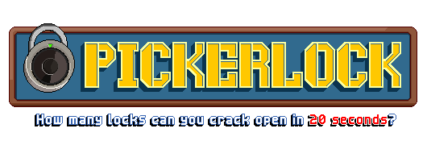
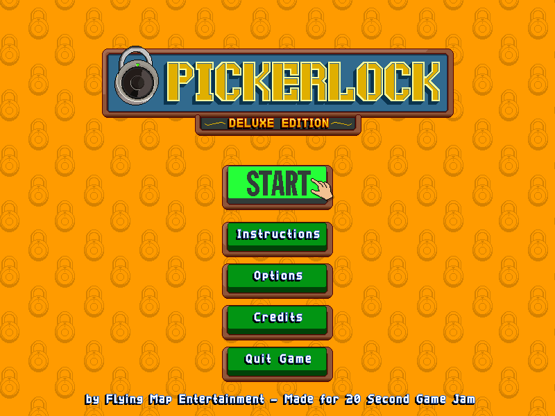
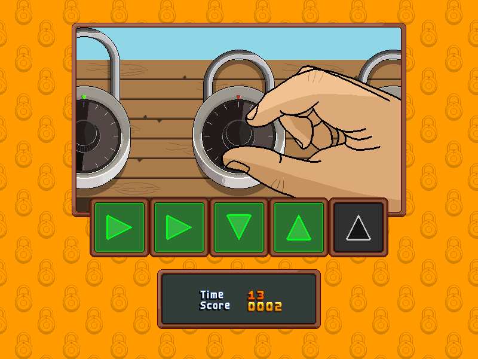

#### A simple lock picking game made for [20 Second Game Jam 2025](https://itch.io/jam/20-second-game-jam-2025).

[See itch.io page.](https://abes400.itch.io/pickerlock)  
Made with [Raylib 5.5](https://www.raylib.com/) using C++.  
Distributed under MIT License.

**[Jump to Build Instructions](#build-instructions)**

<hr>

Main Menu             |  Gameplay
:-------------------------:|:-------------------------:
  |  

<hr>

## About the Game
You don't know how and when you decided to do so, but somehow, you found yourself enrolled in a lock picking contest. No prize, no praise, just 20 seconds  and an opportuity to show off your speed. There is one simple rule: NO MISTAKES! Otherwise, you're out.

### Controls
- **Arrow Keys:** Pick the locks  
- **Mouse:** Interact with menus

### 3 Difficulty Modes
- **Easy:** Each lock opens with **3** moves.
- **Medium:** Each lock opens with **4** moves.
- **Hard:** Each lock opens with **5** moves.

<br>

## Credits
Programming and Visuals - **Abes400**  
Menu Music - **“Safe At Home”** by **[Marcelo Fernández](https://www.marcelofernandezmusic.com/)**  (Licensed under [CC-BY 4.0](https://creativecommons.org/licenses/by/4.0/))  
In-game Music: -  **"A Journey Awaits"** by **[Pierre Bondoerffer](https://opengameart.org/users/pbondoer)**

<br>

## Build Instructions
**NOTE**: From now on, the toppermost directory of this repository will be referred to as the ***Repo Directory***. As you clone this repository, this directory will probably be named as **Pickerlock**. The sub contents of **Repo Directory** should be as follows:  
```
Repo_Directory\
├─ project\
├─ screenshots\
├─ .gitignore
├─ LICENSE
├─ Makefile
└─ README.md
```

### Windows (x64)
- #### Prerequisites for Windows
    - **MSYS2** with MINGW64 [Download Here](https://www.msys2.org/)
    - **GCC** for MINGW64 -- *Run `pacman -S mingw-w64-ucrt-x86_64-gcc` if not installed*
    - **Make** for MINGW64 -- *Run `pacman -S mingw-w64-x86_64-make` if not installed*

- #### Building for Windows
    On MSYS2 MINGW64 Bash:  
    ```
    # Go to the Repo Directory
    cd /path/to/the/Repo_Directory

    # Compile the source code and copy the assets
    make
    ```
    On success, you should see the **output** folder containing the **Standalone Executable** and the **Assets** at `Repo_Directory\dist\windows_x64`.

<br>

### macOS (Universal)
- #### Prerequisites for macOS
    - **Xcode Command Line Tools**  -- *Run `xcode-select --install` to install*

- #### Building for macOS
    On Terminal:
    ```
    # Go to the Repo Directory
    cd /path/to/the/Repo_Directory

    # Compile the source code and pack the Application Bundle
    make osx
    ```
    On success, you should see the **Universal Standalone Application Bundle** at `Repo_Directory/dist/macosx_universal`.

<br>

### Clear the `dist` directory
```
make clear
```